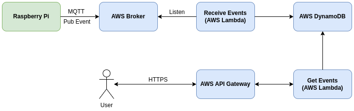

# TCC-AWS-Cloud-Server

<p align="center">
  
</p>

## Recuperando Eventos

**Endpoint:** https://1bglrkm19a.execute-api.us-east-2.amazonaws.com/dev/countEvent

**Requisição HTTPS**

```
GET {endpoint}/countEvent?vehicleId={}&deviceId={}&startDate={}&endDate={}
```

**Parâmetros**

|Parâmetro|Obrigatório|Descrição|
|---------|-----------|---------|
|vehicleId|Sim|Utilizado para agrupar apenas os eventos de contagem do veículo especificado.|
|deviceId|Não|Utilizado para agrupar apenas os eventos de contagem do dispositivo especificado.|
|startDate|Sim|Define o momento a ser utilizado para delimitar o início do agrupamento das contagens.|
|endDate|Não|Define o momento a ser utilizado para delimitar o fim do agrupamento das contagens. Caso o parâmetro não seja especificado, será utilizado a data e hora atual.|

## Publicando Eventos

|Item|Valor|
|----|-----|
|Tópico|counting-device/count-event/\<device-id\>|
|IoT Host|alll56eu5mqjy-ats.iot.us-east-2.amazonaws.com|
|IoT Region|us-east-2|
|Autenticação Utilizada|[Sig-v4](https://docs.aws.amazon.com/AmazonS3/latest/API/sig-v4-authenticating-requests.html) (Requer: IoT Host, IoT Region, Access Key, Secret Access Key.)|

